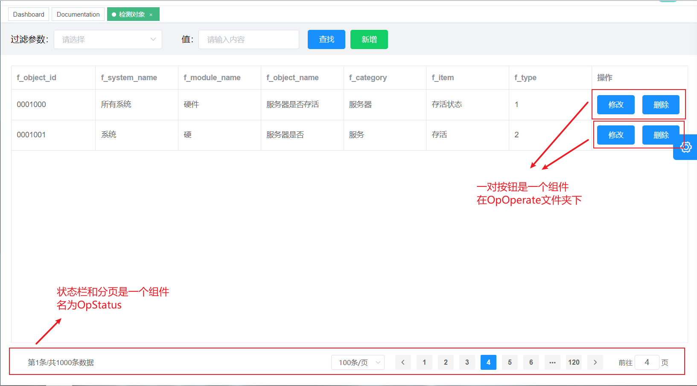

#开发文档
*请先阅读readme文件，在components->opdict->OpOperate中存在另一个readme文件*
##字典表opdict
###前端页面结构说明：

***所有的组件放在components文件夹下的Opdict文件夹里***
1. 检测对象维护：Object
2. 运维指标字典表维护:：Signal
3. 运维事件字典表维护：Opcid
4. 运维状态字典表维护：Status
5. 服务类型表维护：Service
6. 状态栏：OpStatus
###文件说明
***所有的页面放到views文件夹下的opdict文件夹下***
1. 检测对象维护：object
2. 运维指标字典表维护:：signal
3. 运维事件字典表维护：opcid
4. 运维状态字典表维护：status
5. 服务类型表维护：service
